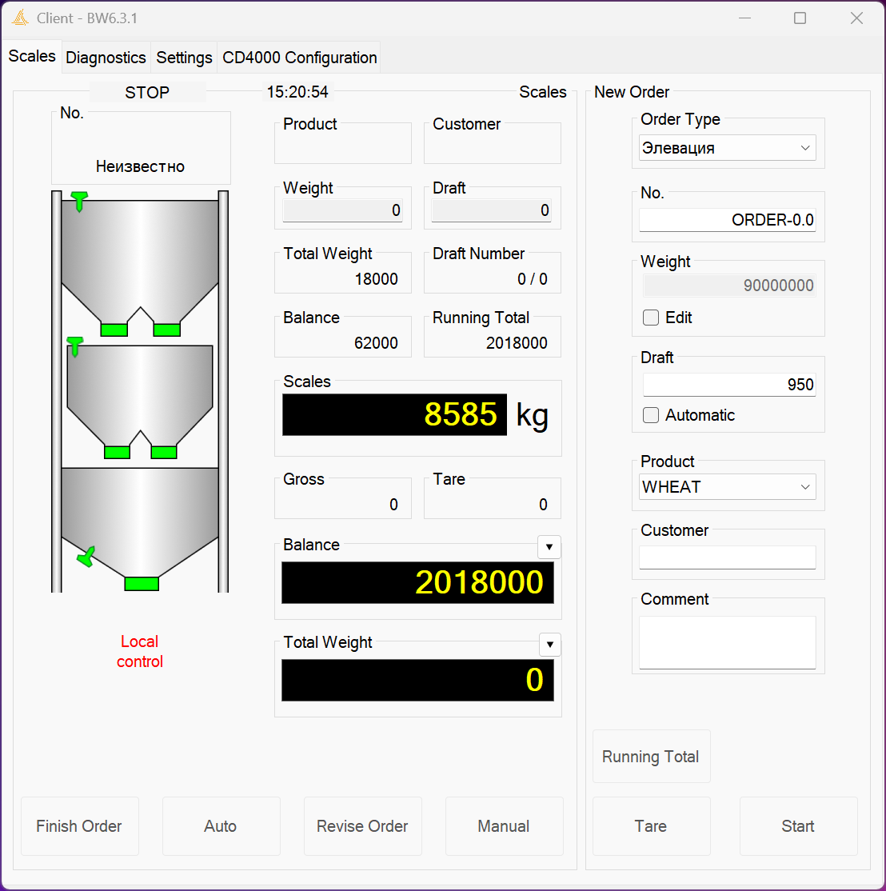
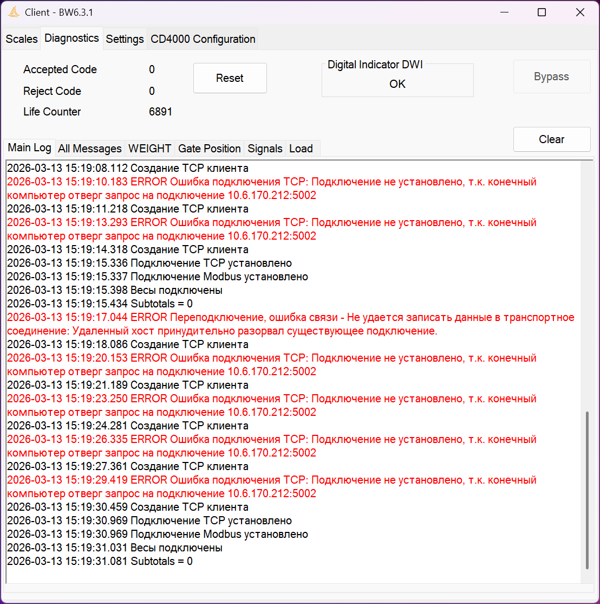
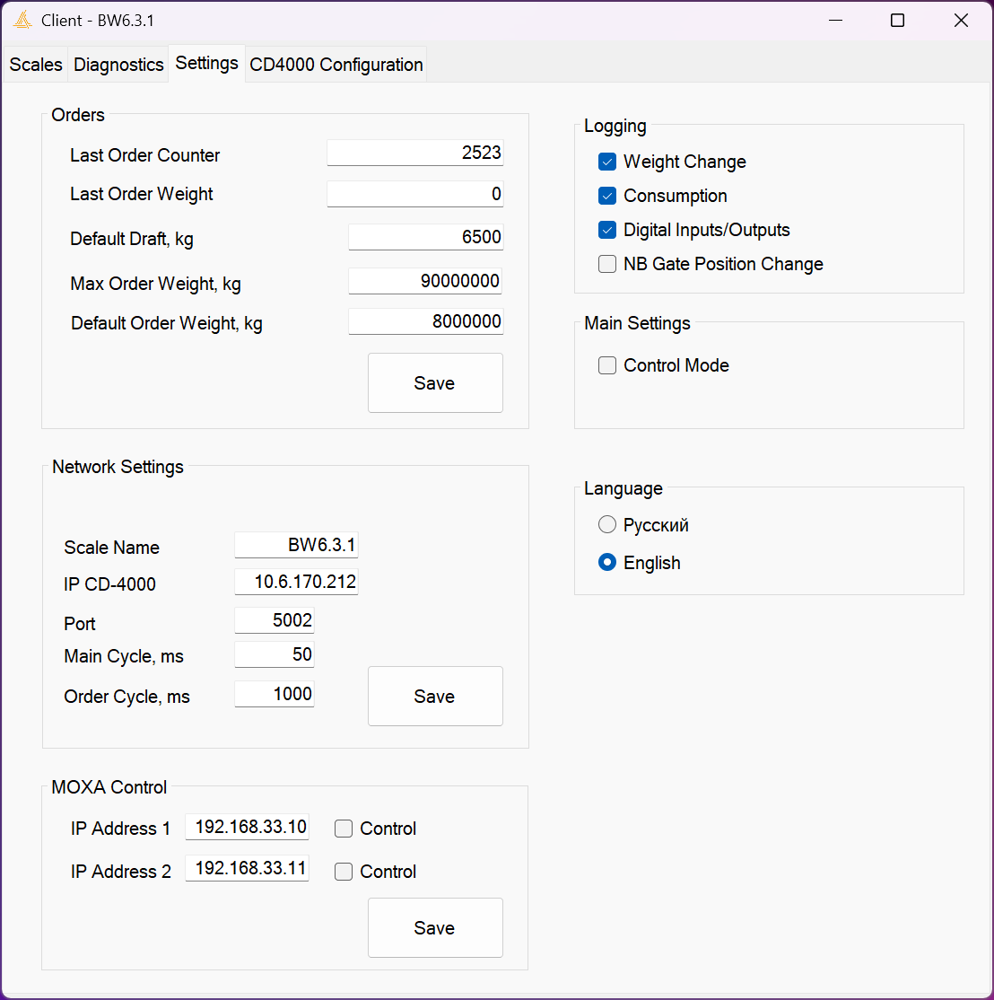
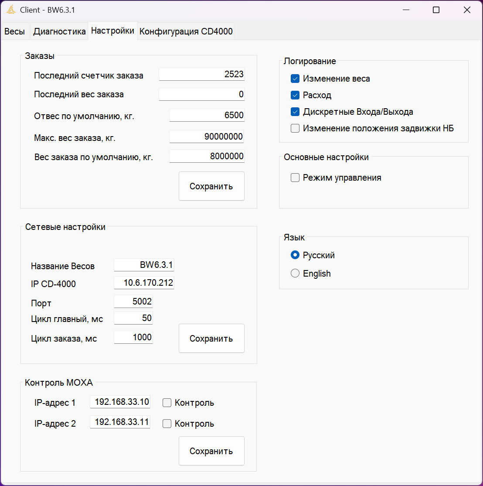

# Client CompuWeigh scale
Client software for hopper scales CompuWeigh company. Windows form app, use modbus TCP client, logs, config, language localization use JSON and ather things.. I can't show the source code

# Main screen
Custom information of scale and config for new order

# Logs screen
Logs information use NLog lib. Logs write on files and on form.

# Setting screen
Setting parameter for application. Use .config and JSON file for language localization

